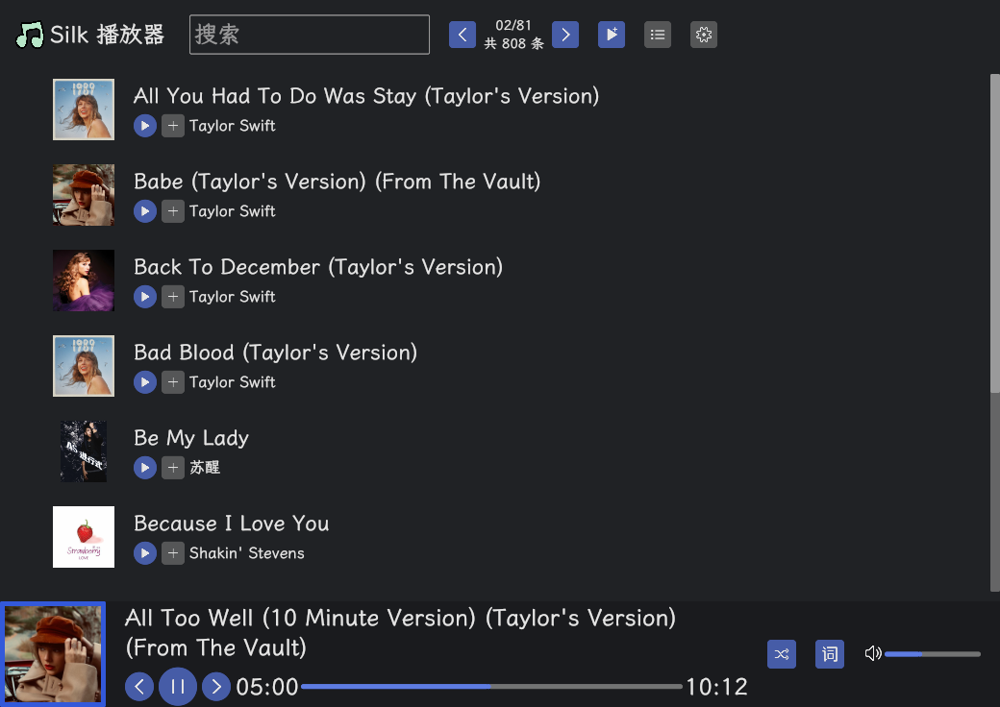
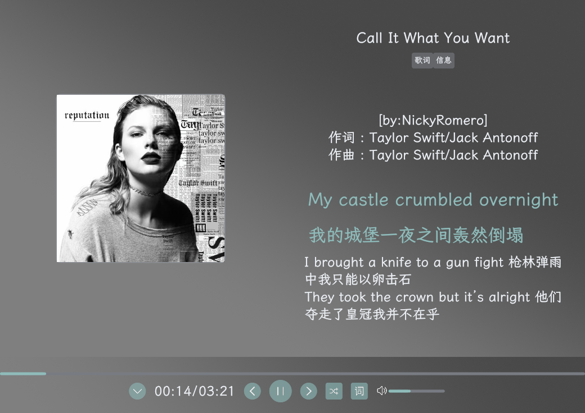
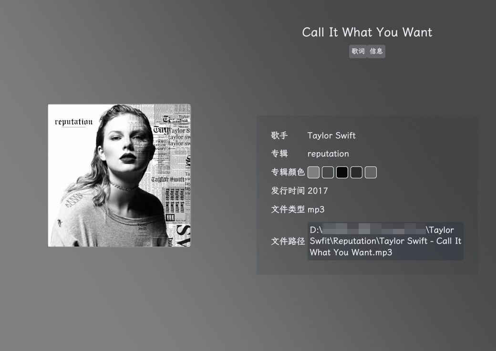
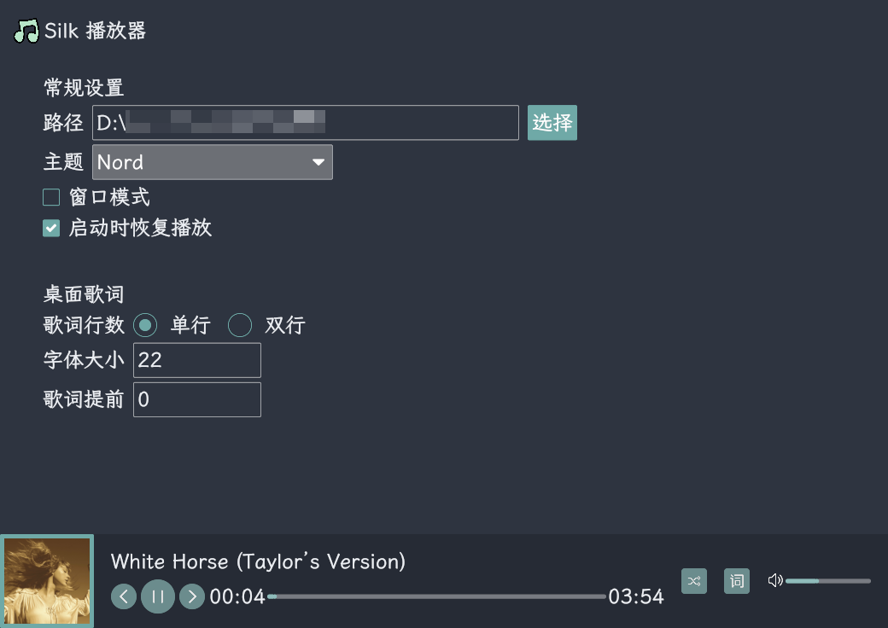

# Silk Player

一款使用 Rust 语言编写的本地音乐播放器，使用了 Iced 框架，拥有美观的界面设计。

## 功能特性

- 桌面歌词
- 播放页面
- 进度控制
- 播放控制
- 音量调节
- 多播放模式
- 歌曲筛选
- 全局热键
- 软件内热键
- 播放列表
- 自定义配置
- 多主题切换
- 随机听歌模式
- 专辑封面颜色特征提取

## 界面展示

首页




播放页-歌词




播放页-信息-隐藏播放条




设置




## 快速开始

启动应用

```sh
cargo run
```

编译应用

```sh
cargo build --release
```

## 依赖库

- UI 框架 iced
- 图片处理 image
- 时间处理 chrono
- 随机数 rand
- 序列化 serde_json,serde
- 音乐标签读取 music-tag = "=0.1.0"
- 文件选择器 rfd
- 音乐播放控制 kira
- 打开应用 open
- 全局热键 device_query

## 更新日志

- 2024-05-08 
	- 废弃模糊背景，更换为专辑特征颜色提取线性模糊背景
	- 完成歌词自动滚动
	- 完成歌曲播放模式：单曲循环、列表循环、随机播放
	- 完成音量配置
	- 图片像素颜色提取工具
- 2024-05-14
	- 全面更新 UI 设计，更加美观
- 2024-05-16
	- 修复播放时间校准问题
	- 设定新 Logo，打包可执行文件
	- 优化代码结构
	- 引入线程池技术，减少生成专辑封面的线程数性能消耗，缓解CPU瞬间飙高问题
	- 启动应用支持恢复上次播放状态
	- 优化切歌时专辑封面不刷新等细节问题
- 2024-06-12
	- 新增全局快捷键支持
	- 桌面歌词提前显示配置
- 2024-08-30
  - 优化应用启动速度，后台执行初始化任务
  - 增加歌单功能，根据本地路径结构整理出歌单列表
  - 增加快捷键说明
  - 优化专辑封面信息提取效率
- 2024-10-10
  - 提高进程cpu优先级，解决cpu占用满时播放卡顿问题
